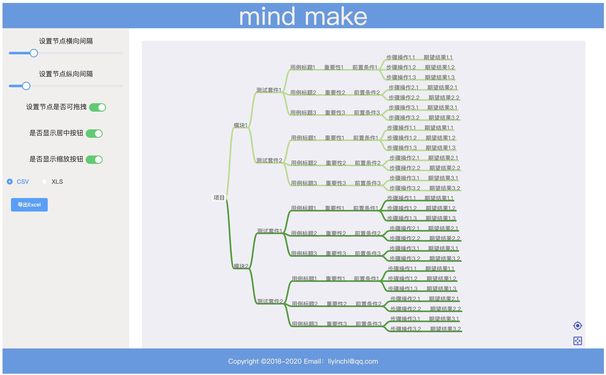
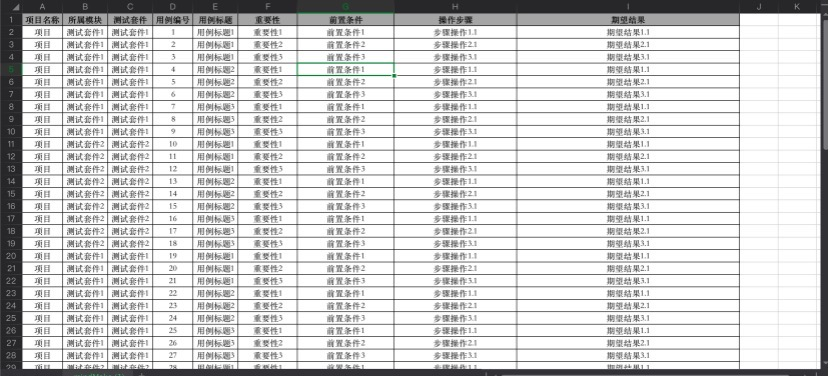

# MindMake

## 功能

思维导图编写测试用例，导出多种格式文件数据

## 使用

### 1.假设你的电脑已安装nodejs环境

### 2.设置淘宝镜像
```
npm config set registry http://registry.npm.taobao.org/
```

### 3.进入目录

```
cd MindMake
```
### 4.安装
```
npm install
```

### 5.启动

```
npm run dev
```

### 6.浏览器地址访问
>http://localhost:8088/#/







# TODO 
1.导出json文件

2.导出图片、PDF

3.导出支持testlink xml格式文件

4.导出数据再导入MindMake

5.操作记录保留


