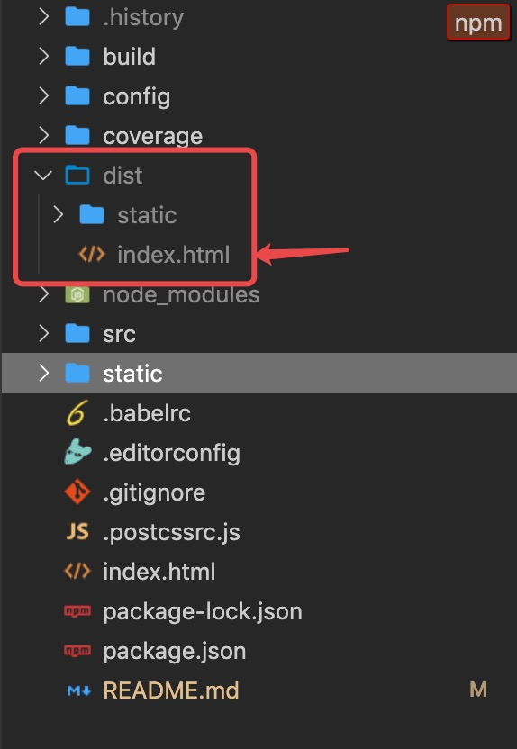
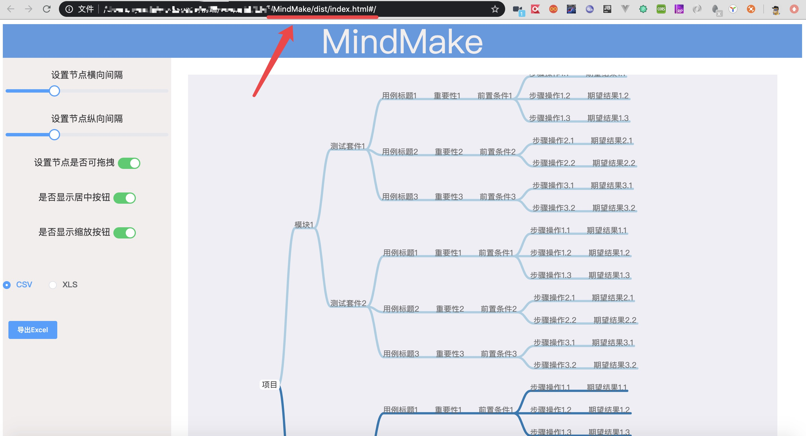

# MindMake

## 功能

思维导图编写测试用例，导出多种格式文件数据

recommend: [China-Gitee](https://gitee.com/liyinchi/MindMake)，[Other-Github](https://github.com/Musule/MindMake)

## 直接使用

直接使用，打开目录下index.html文件即可

```
./dist/index.html
```







## 二次开发

### 环境要求
tool  | version
------------- | -------------
 nodejs  | >8.17.0

### 1.安装nodejs环境

下载Nodejs

（建议版本使用v12.13.0 小于v15.0）

>https://npm.taobao.org/mirrors/node/v12.13.0/

>如果已安装配置nodejs，可跳过此步骤


### 2.设置淘宝镜像
```
npm config set registry http://registry.npm.taobao.org/
```

### 3.进入目录

```
cd MindMake
```
### 4.安装
```
npm install
```

### 5.启动

```
npm run dev
```

### 6.浏览器地址访问
>http://localhost:8088/#/


# TODO 
1.导出json文件

2.导出图片、PDF

3.导出支持testlink xml格式文件

4.导出数据再导入MindMake

5.操作记录保留


